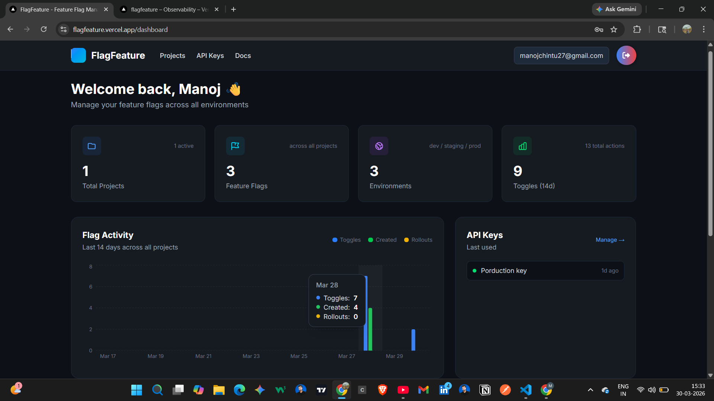
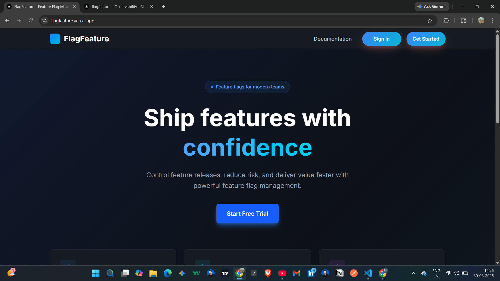

# 🚀 FlagFeature

> Production-grade feature flag platform built with Next.js 15.
> Ship features safely. Roll out gradually. Never break production.

---

## 🌐 Live Demo

🔗 https://flagfeature.vercel.app

---

## 📸 Screenshots

### Dashboard & Analytics



### Feature Flag Management



---

## 🧠 What is FlagFeature?

FlagFeature is a **self-hosted feature flag platform** (like LaunchDarkly or Flagsmith) built from scratch.

It allows teams to ship features safely without redeploying code.

### 🛠 How it works:

* Deploy code behind a flag (disabled by default)
* Enable for 5% of users
* Monitor behavior
* Gradually roll out to 100%
* Instantly disable if something breaks

---

## ✨ Features

* 🎯 **Percentage Rollouts**
  Gradual rollout using deterministic user hashing (no flickering)

* 🌍 **Multi-Environment Support**
  Manage flags across development, staging, production

* 📊 **Analytics Dashboard**
  14-day activity tracking + API usage insights

* 📝 **Audit Logs**
  Track every change (toggle, delete, rollout updates)

* 👥 **Team Management**
  OWNER / ADMIN / MEMBER / VIEWER roles

* 🔐 **API Key Authentication**
  Secure SDK access with usage tracking

* ⚡ **Fast SDK Endpoint**
  Single request returns all flags in <10ms

* 🗑 **Safe Flag Deletion**
  Confirmation + audit trail

---

## 🛠 Tech Stack

| Layer     | Technology              | Purpose        |
| --------- | ----------------------- | -------------- |
| Framework | Next.js 15 (App Router) | Full-stack app |
| Language  | TypeScript              | Type safety    |
| Database  | PostgreSQL (Neon)       | Serverless DB  |
| ORM       | Prisma                  | DB queries     |
| Auth      | JWT + bcrypt            | Authentication |
| State     | Zustand                 | Client state   |
| Charts    | Recharts                | Analytics      |
| Styling   | Tailwind CSS            | UI design      |
| Deploy    | Vercel                  | Hosting        |

---

## 🚀 Getting Started

### Prerequisites

* Node.js 18+
* Neon account

### Installation

```bash
git clone https://github.com/Manoj-M19/flag-feature.git
cd flag-feature
npm install
```

### Setup Environment

```bash
cp .env.example .env
```

Add:

```env
DATABASE_URL="your_database_url"
JWT_SECRET="your_secret"
```

### Run App

```bash
npx prisma migrate dev
npm run dev
```

---

## ⚡ SDK Usage

```bash
GET /api/sdk/evaluate?projectId=YOUR_ID&environment=production&userId=user_123
x-api-key: YOUR_API_KEY
```

### React Hook Example

```ts
import { useEffect, useState } from "react";

export function useFlags(userId: string) {
  const [flags, setFlags] = useState<Record<string, boolean>>({});

  useEffect(() => {
    fetch(
      `https://flagfeature.vercel.app/api/sdk/evaluate?projectId=${process.env.NEXT_PUBLIC_PROJECT_ID}&environment=production&userId=${userId}`,
      {
        headers: {
          "x-api-key": process.env.NEXT_PUBLIC_FLAG_API_KEY!,
        },
      }
    )
      .then((r) => r.json())
      .then((data) => setFlags(data.flags ?? {}));
  }, [userId]);

  return flags;
}
```

---

## 🔢 Rollout Logic

```
userId + flagKey → hash → number (0–100)

Example:
hash = 34

rollout 10% → ❌
rollout 50% → ✅
rollout 100% → ✅
```

---

## 🌐 Deployment

* Vercel (Frontend + API)
* Neon (PostgreSQL)

---

## 👨‍💻 Author

**Manoj M**

---

## 📄 License

MIT License © Manoj M

---

⭐ If you like this project, give it a star!
